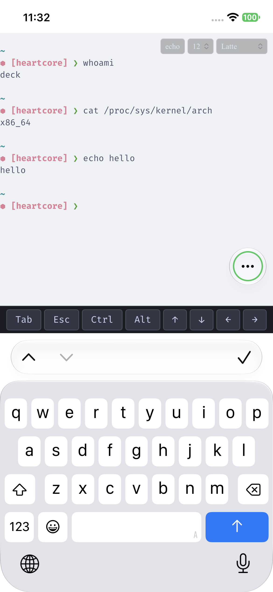

# miniwerm

Minimal web terminal. Shell in the browser at `http://localhost:7654`.

Uses [wterm](https://github.com/vercel-labs/wterm) for DOM-rendered terminals (native selection, copy/paste, Ctrl+F).

## Setup

Requires Node.js 18+ and pnpm 9+.

```bash
pnpm install
pnpm start
```

Open `http://localhost:7654`.

## Features

- Shell access via WebSocket + node-pty
- DOM-rendered (native selection, copy/paste, browser find)
- Persistent sessions survive disconnects (mobile lock, network drop)
- Auto-reconnect with backoff
- Catppuccin themes (Mocha, Macchiato, Frappé, Latte)
- FiraCode font, adjustable size
- Mobile modifier bar (Tab, Esc, Ctrl, Alt, arrows)
- Local echo toggle for fast connections
- Localhost-only (no network access)

## Screenshot



## Sessions

Each browser gets a unique ID in `localStorage`. On disconnect the server keeps the PTY alive; reconnect resumes the same shell. Sessions expire after 30min (configurable).

## CLI Options

| Flag | Env | Default | Example |
|------|-----|---------|---------|
| `--port` | `PORT` | `7654` | `pnpm start -- --port 8080` |
| `--shell` | `SHELL` | `/bin/bash` | `pnpm start -- --shell /bin/zsh` |
| `--timeout` | — | `1800000` (30m) | `pnpm start -- --timeout 600000` |
